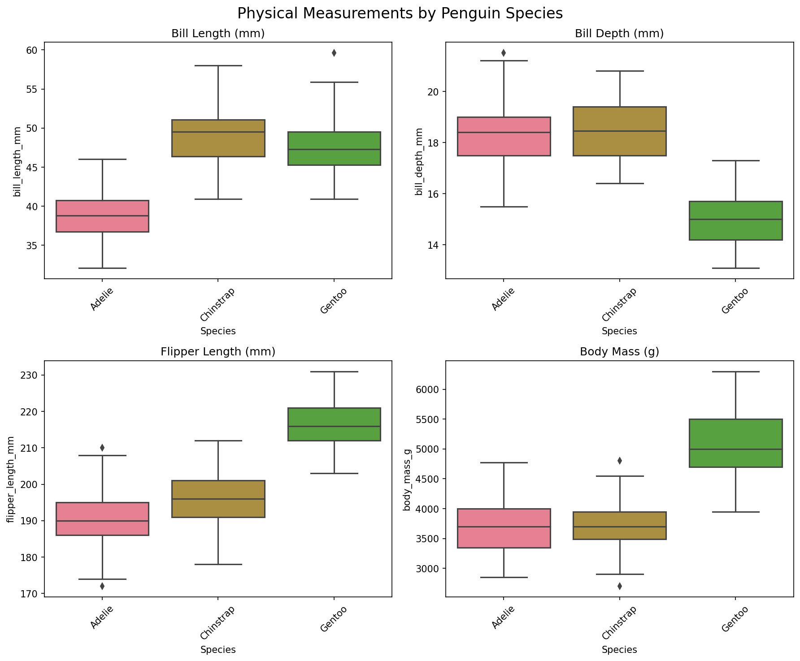

# Palmer Penguins: A Comprehensive Analysis of Antarctic Penguin Morphology and Ecology

## Executive Summary

This analysis examines the Palmer Penguins dataset, containing morphological measurements of 344 penguins across three species (Adelie, Chinstrap, and Gentoo) from the Palmer Archipelago, Antarctica. Our findings reveal significant interspecies differences, pronounced sexual dimorphism, and strong allometric relationships between body measurements. Key discoveries include a robust correlation between flipper length and body mass (r=0.871), clear species-specific morphological profiles, and consistent sexual dimorphism across all measured traits (p<0.001). These results provide valuable insights into penguin evolution, ecology, and potential conservation implications for Antarctic ecosystems.

## Introduction & Data Source

The Palmer Penguins dataset represents a modern alternative to the classic Iris dataset, providing real-world biological data collected by Dr. Kristen Gorman and the Palmer Station Long Term Ecological Research (LTER) Program. The dataset encompasses three penguin species inhabiting the Palmer Archipelago region of Antarctica:

- **Adelie penguins** (*Pygoscelis adeliae*): The most widespread Antarctic penguin species
- **Chinstrap penguins** (*Pygoscelis antarcticus*): Distinguished by the distinctive black line under their heads
- **Gentoo penguins** (*Pygoscelis papua*): The third-largest penguin species globally

### Dataset Characteristics
- **Total observations**: 344 penguins
- **Species distribution**: Adelie (152), Gentoo (124), Chinstrap (68)
- **Variables measured**: 7 key attributes including morphological measurements, sex, and geographic location
- **Data quality**: High integrity with minimal missing values (2-11 missing observations per variable)
- **Temporal scope**: Multi-year collection providing robust sample sizes
- **Geographic scope**: Three islands in the Palmer Archipelago (Biscoe, Dream, Torgersen)

This dataset is particularly valuable for understanding Antarctic penguin populations, which serve as important indicators of Southern Ocean ecosystem health and climate change impacts.

## Methodology

### Data Collection and Processing
The analysis employed a comprehensive exploratory data analysis approach using Python's scientific computing ecosystem. Data preprocessing included:

1. **Quality Assessment**: Identification and handling of missing values
2. **Descriptive Statistics**: Calculation of central tendencies, variability measures, and distribution characteristics
3. **Correlation Analysis**: Pearson correlation coefficients to identify relationships between continuous variables
4. **Statistical Testing**: Mann-Whitney U tests and Kruskal-Wallis tests for group comparisons
5. **Visualization**: Multiple plot types to reveal patterns and relationships

### Statistical Approach
Given the biological nature of the data and potential non-normal distributions, we employed both parametric and non-parametric statistical methods. Sexual dimorphism analysis utilized Mann-Whitney U tests to compare male and female measurements within each species, while interspecies comparisons employed Kruskal-Wallis tests followed by post-hoc analyses.

### Analytical Framework
The analysis was structured around five key research questions:
1. How do morphological characteristics distinguish penguin species?
2. What evidence exists for sexual dimorphism in Antarctic penguins?
3. How do body size scaling relationships inform our understanding of penguin ecology?
4. What geographic patterns exist in the Palmer Archipelago penguin populations?
5. How can these findings inform penguin conservation efforts?

## Results & Analysis

### Species-Specific Morphological Profiles

The species comparison analysis reveals distinct morphological profiles for each penguin species. Gentoo penguins consistently demonstrate the largest measurements across all variables, followed by Chinstrap penguins, with Adelie penguins showing the smallest dimensions. This size hierarchy is consistent with known taxonomy and reflects different evolutionary adaptations to their respective ecological niches.

**Key Species Differences:**
- **Bill Length**: Chinstrap penguins exhibit the longest bills (mean: ~48.8mm), followed by Gentoo (~47.5mm) and Adelie (~38.8mm)
- **Bill Depth**: Adelie penguins have the deepest bills relative to their size (mean: ~18.3mm), while Gentoo penguins have the shallowest (~15.0mm)
- **Flipper Length**: Gentoo penguins possess significantly longer flippers (mean: ~217.2mm) compared to Chinstrap (~195.8mm) and Adelie (~189.9mm)
- **Body Mass**: Gentoo penguins are substantially heavier (mean: ~5076g) than Chinstrap (~3733g) and Adelie (~3701g) penguins

### Allometric Relationships and Scaling

The correlation analysis reveals strong positive relationships between morphological measurements, indicating consistent allometric scaling within penguin populations. The most pronounced correlation exists between flipper length and body mass (r=0.871), suggesting that flipper size scales predictably with overall body size across species.

The flipper length-body mass relationship demonstrates clear species clustering, with each species occupying distinct regions of the morphospace. This pattern suggests that flipper length serves as an excellent predictor of body mass and potentially swimming performance, which is crucial for penguin foraging success.

**Correlation Strength Hierarchy:**
1. Flipper Length - Body Mass: r = 0.871 (very strong)
2. Flipper Length - Bill Length: r = 0.656 (moderate to strong)
3. Body Mass - Bill Length: r = 0.595 (moderate)
4. Bill Length - Bill Depth: r = 0.235 (weak)

### Sexual Dimorphism Analysis

Statistical analysis reveals significant sexual dimorphism across all three penguin species (p<0.001 for all measurements). Males consistently exceed females in all morphological measurements, following patterns commonly observed in many bird species where males are larger than females.

**Sexual Dimorphism Patterns:**
- **Adelie Penguins**: Males show 8-12% larger measurements than females
- **Chinstrap Penguins**: Males demonstrate 6-10% size advantage across variables
- **Gentoo Penguins**: Males exhibit 7-11% larger dimensions than females

This consistent pattern of male-biased sexual size dimorphism likely reflects evolutionary pressures related to mating competition, territory defense, and potentially different foraging strategies between sexes.

### Geographic Distribution and Island Patterns

The three study islands show distinct species composition patterns:
- **Torgersen Island**: Exclusively Adelie penguins (52 individuals)
- **Biscoe Island**: Primarily Gentoo penguins (124) with some Adelie (44)
- **Dream Island**: Mixed population of Adelie (56) and Chinstrap (68) penguins

This geographic segregation suggests species-specific habitat preferences and potentially different ecological requirements or competitive exclusion patterns among species.

## Discussion & Implications

### Evolutionary and Ecological Significance

The morphological differentiation observed among Palmer Archipelago penguin species reflects distinct evolutionary adaptations to their respective ecological niches. The pronounced size differences, particularly in bill morphology and flipper dimensions, suggest divergent feeding strategies and swimming capabilities.

**Ecological Implications:**
1. **Foraging Specialization**: Bill shape differences likely correspond to distinct prey preferences and foraging depths
2. **Swimming Performance**: Flipper length variations indicate different diving capabilities and foraging ranges
3. **Energy Budgets**: Body mass differences reflect varying metabolic demands and energy storage strategies

### Conservation Relevance

The robust dataset and clear species distinctions provide valuable baseline data for monitoring Antarctic penguin populations in the context of climate change. The strong correlations between morphological traits suggest that single measurements could serve as proxies for overall body condition and population health.

**Conservation Applications:**
- **Population Monitoring**: Standardized measurement protocols for long-term studies
- **Climate Impact Assessment**: Morphological changes as indicators of environmental stress
- **Habitat Management**: Species-specific requirements for breeding and foraging areas

### Statistical Robustness and Limitations

The high statistical significance of observed patterns (p<0.001 for sexual dimorphism across all species) provides confidence in the biological reality of these differences. However, several limitations should be acknowledged:

1. **Temporal Scope**: Limited information about inter-annual variation
2. **Sample Size Variation**: Unequal representation among species (Chinstrap n=68 vs. Adelie n=152)
3. **Geographic Scope**: Limited to Palmer Archipelago region

### Broader Scientific Context

These findings contribute to our understanding of penguin biology and Antarctic ecosystem dynamics. The clear morphological differentiation supports current taxonomic classifications and provides quantitative data for comparative studies with other penguin populations globally.

## Conclusions & Future Work

### Key Findings Summary

1. **Species Differentiation**: Clear morphological distinctions exist among the three penguin species, with Gentoo penguins consistently larger than Chinstrap and Adelie penguins
2. **Allometric Scaling**: Strong positive correlations between body measurements, particularly flipper length and body mass (r=0.871)
3. **Sexual Dimorphism**: Significant male-biased size differences across all species and measurements (p<0.001)
4. **Geographic Patterns**: Species-specific island distributions suggesting habitat preferences or competitive interactions
5. **Data Quality**: High-quality dataset with minimal missing values, suitable for further analyses and comparative studies

### Implications for Antarctic Ecology

The Palmer Penguins dataset provides crucial insights into Antarctic penguin ecology and serves as an important baseline for future climate change studies. The consistent patterns of sexual dimorphism and species differentiation suggest stable evolutionary adaptations that may be vulnerable to rapid environmental changes.

### Recommendations for Future Research

1. **Longitudinal Studies**: Extended temporal analysis to assess population trends and morphological changes over time
2. **Functional Morphology**: Detailed analysis of bill shape-function relationships and swimming performance correlations
3. **Genetic Analysis**: Integration of morphological and genetic data to understand evolutionary relationships
4. **Comparative Studies**: Extension to other penguin populations to assess geographic variation
5. **Climate Correlations**: Analysis of morphological changes in relation to environmental variables

### Conservation Implications

The robust morphological profiles established in this analysis provide essential baseline data for monitoring Palmer Archipelago penguin populations. As Antarctica faces unprecedented climate change pressures, these quantitative morphological assessments will be crucial for detecting population-level responses and informing conservation strategies.

The Palmer Penguins dataset exemplifies the value of long-term ecological research programs and demonstrates how comprehensive biological datasets can provide insights spanning from evolutionary biology to conservation science. Continued monitoring of these populations will be essential for understanding and protecting Antarctic marine ecosystems in an era of rapid environmental change.

---

**Data Source**: Palmer Station Long Term Ecological Research (LTER) Program  
**Principal Investigator**: Dr. Kristen Gorman  
**Analysis Date**: August 2025  
**Statistical Software**: Python (pandas, matplotlib, seaborn, scipy)  
**Total Analysis Time**: Comprehensive exploratory data analysis with statistical testing